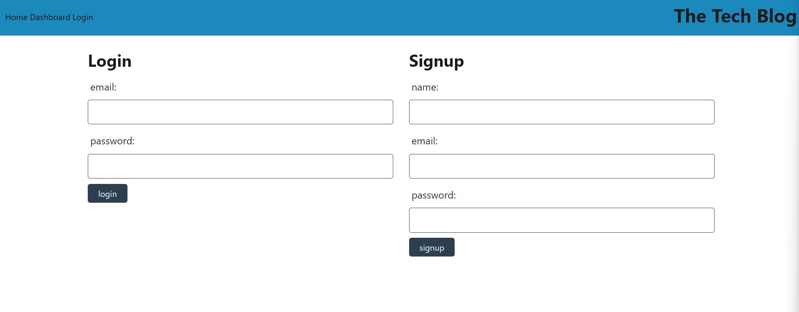
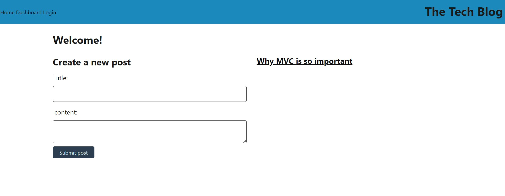
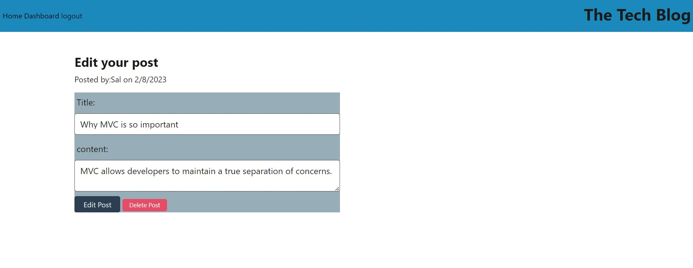
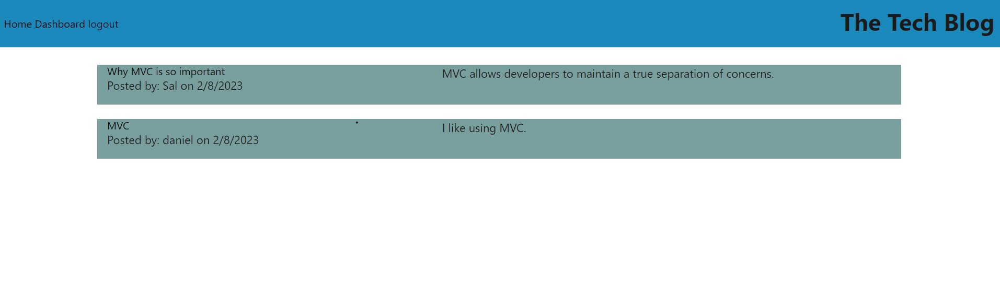
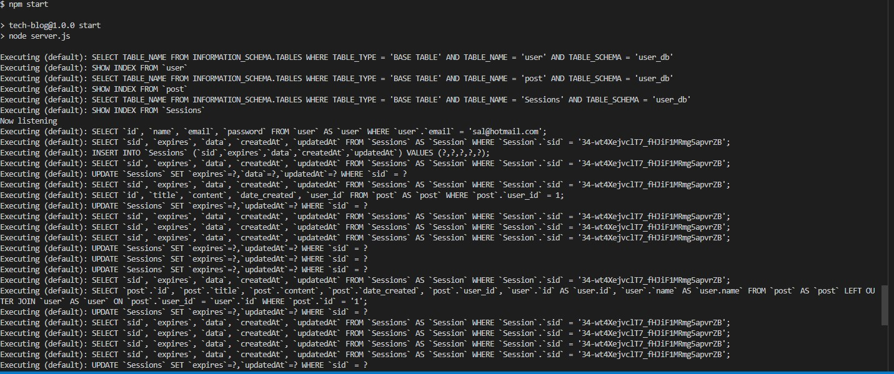

# 14 Model-View-Controller (MVC): Tech Blog

table of contents
  - [About the project](#abouttheproject)
  - [Installation](#installation)
  - [description](#description)
  - [Usage](#usage)
  - [Credits](#credits)
  - [license](#license)

## About the project ##

The main purpose of the project is to create an application called "The Tech  Blog", this app is for users to publish articles, blog posts, thoughts and opinions. As developers using index page by page to render each one with links it is easy but with this app is time saving, since using the server express so the user once clicks on the main page can see posts from other people and also being able to comment and edit or delete his own.

This app is focused on developers who want to share information and be able to see other user's ideas and posts. The user can save his posts and be able to see what other developers or users share thorugh this app.

## Installation ##
In order to be able to use this app Note Taker, the user needs to install a `package.json` by using the command line `npm init` and the node modules will be installed too, with the package-lockjson. then run in the command line `npm i` and the packages are already listed in order to be able to use for the user like 
"bcrypt": "^5.0.0",
    "connect-session-sequelize": "^7.0.4",
    "dotenv": "^8.2.0",
    "express": "^4.17.1",
    "express-handlebars": "^5.2.0",
    "express-session": "^1.17.1",
    "mysql2": "^2.2.5",
    "sequelize": "^6.3.5".

    Once the user has the necessary packages to be able to use this app. 
   

## Description

This project is for everyone who is interested in being in Technology like developes and change opinions, posts, ideas, thoughts, articles with others so they can communicate through a post and being abel to interact with another user through a comment on their posts.

The user can add, delete, update his posts based on his needs and thoughts, The users can interact  once they sign up or log into the website to be able to interact with it. 

Once the user is connected to the server, he will be redirected to the homepage where the user can see other users's posts, in order to comment or add a post the user needs to sign up and provide a name, email and password, once the user is logged in he can go to the dashboard and create a post with a title and content, once the user clicks the submit button the user can see his posts on the homepage and have acces to the post with a link to redirect to the edit post page and the user can modify the post or delete it.

Once logged in the user can comment other user's posts and be able to share thoughts about technology topics.
If the user cannot log in, it means the email or password is not verified and needs to correct since a message will be sent "fail to login" or in the case of sign up if the criteria of name, email and password are not applied there will be a message " fail to sign up"
 
Once the user finished deleting, adding or commenting and wants to close his session he will click on logout button and will be redirect to the sign in page.

## Usage ##

The main reason of this app is to share tech content with other users and at the same time get information about certain topics are showed as articles,posts, or ideas. 
The user will have to open the command line and type `npm i` and all the packages willl be listed already in `package json`
"bcrypt": "^5.0.0",
    "connect-session-sequelize": "^7.0.4",
    "dotenv": "^8.2.0",
    "express": "^4.17.1",
    "express-handlebars": "^5.2.0",
    "express-session": "^1.17.1",
    "mysql2": "^2.2.5",
    "sequelize": "^6.3.5".
     
   Then he can run in the command line `mysql -u root -p` and then `password`. And be able to acces the data ` source schema.sql;` and then `npm run seed` and finally being able to run the server `npm start` and the user has access to the data and run the server to see the functionallity of the app.

- [The Tech Blog deployed app in Heroku link]()

## Credits 

N/A

## License 
N/A 